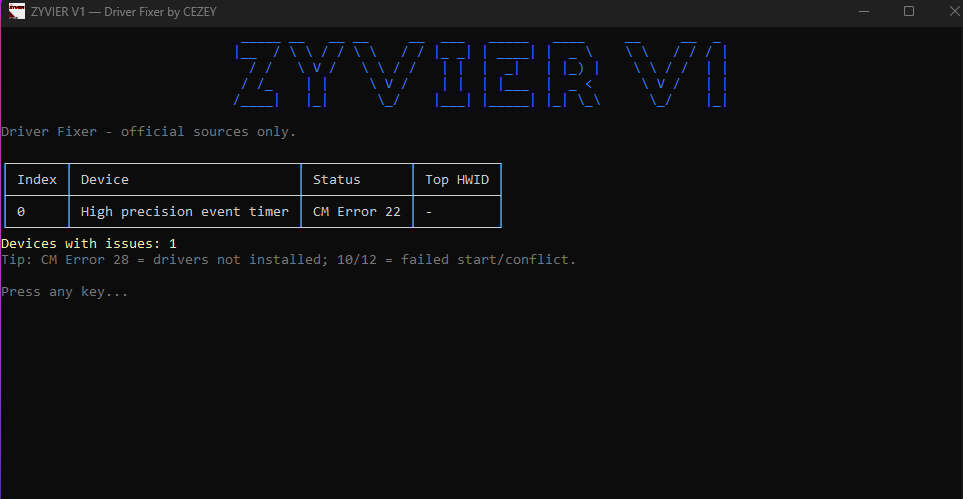

# ZYVIER V1 - Driver Fixer 
This program helps with scanning current driver problems and windows updates (problems) and reassures to fix them or if it can't fix, it tells you exactly what the problem and tries to redirect you to fix manually.

## Example of scanning:

### Features
- Can scan any driver problem/error that you have
- Fix Windows Updates
- Fix selected updates via windows update (gives you a menu from 0 to N, depends what problem and driver occurred, it gives you an Index, if you have 0..4, you should try to start from 0 then upwards)
- Open Vendor Page (OEM Detect) (Note: My program doesn't detect all oem motherboards urls, some of them work, some may not)
- Can open Microsoft Update Catalog for selected
- Install local INF (pnputil)
- Rescan (PnP)
- Logs everything that the program does in C:\Users\*YOURUSER*\AppData\Local\ZYVIER\Logs

